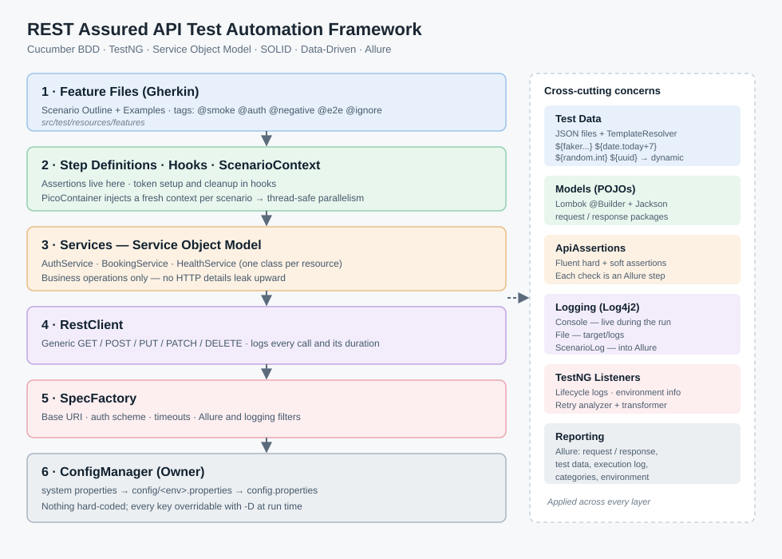
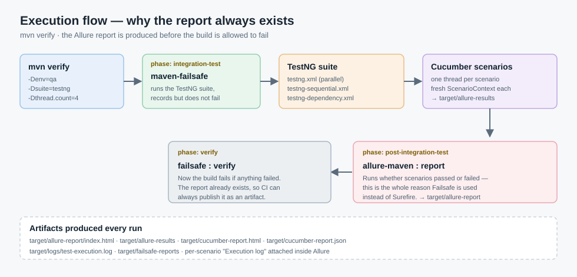

# REST Assured API Test Automation Framework

A maintainable, scalable, reusable BDD framework for testing **any** REST API — built with
**REST Assured + Cucumber + TestNG + Allure**, following **OOP, SOLID, Service Object Model**
(the API analogue of Page Object Model) and a fully **data-driven, dynamic** approach with
**zero hard-coded values**.

Demo target: [Restful-Booker](https://restful-booker.herokuapp.com) — a public CRUD + token-auth API.



---

## Table of contents

1. [Quick start](#1-quick-start)
2. [How to run — every option](#2-how-to-run--every-option)
3. [Architecture explained layer by layer](#3-architecture-explained-layer-by-layer)
4. [Dynamic data (no static values)](#4-dynamic-data-no-static-values)
5. [Data-driven with JSON and Scenario Outline](#5-data-driven-with-json-and-scenario-outline)
6. [Assertions](#6-assertions)
7. [Logging — console, file, and inside the report](#7-logging--console-file-and-inside-the-report)
8. [Allure reporting](#8-allure-reporting)
9. [Listeners](#9-listeners)
10. [Parallel, sequential, and dependency execution](#10-parallel-sequential-and-dependency-execution)
11. [GitHub Actions](#11-github-actions)
11a. [Jenkins](#11a-jenkins)
12. [Extending to a new API](#12-extending-to-a-new-api)
13. [Project structure](#13-project-structure)
14. [Troubleshooting](#14-troubleshooting)

---

## 1. Quick start

**Prerequisites:** JDK 21 and Maven 3.9+ (or use IntelliJ's bundled Maven — see below).

```bash
git clone <your-repo-url>
cd Task_Sr_API_AbdElghany
mvn clean verify
```

That single command compiles, runs all scenarios in parallel, generates the Allure report, and
then fails the build if anything failed. Open the result:

```
target/allure-report/index.html
```

> **Always include `clean`.** Allure results accumulate in `target/allure-results`; without
> `clean` you will see stale scenarios from previous runs merged into the report.

**No Maven on PATH?** IntelliJ ships one:

```powershell
& "$env:LOCALAPPDATA\Programs\IntelliJ IDEA 2026.1\plugins\maven\lib\maven3\bin\mvn.cmd" clean verify
```

---

## 2. How to run — every option

| Goal | Command |
|---|---|
| Everything, parallel (default) | `mvn clean verify` |
| Bare `mvn` (defaultGoal is `verify`) | `mvn` |
| Sequential, one scenario at a time | `mvn clean verify -Dsuite=testng-sequential` |
| Smoke gates regression | `mvn clean verify -Dsuite=testng-dependency` |
| Change parallel thread count | `mvn clean verify -Dthread.count=8` |
| Switch environment | `mvn clean verify -Denv=prod` |
| Override any config key | `mvn clean verify -Dbase.uri=https://staging.example.com` |
| Inject credentials (never commit them) | `mvn clean verify -Dauth.username=ci -Dauth.password=$SECRET` |
| Run a subset by tag | `mvn clean verify -Dcucumber.filter.tags="@smoke"` |
| Complex tag filter | `mvn clean verify -Dcucumber.filter.tags="@booking and not @e2e"` |
| Retry flaky failures twice | `mvn clean verify -Dretry.max.count=2` |
| Open the report in a browser | `mvn allure:serve` |

> ⚠️ `-Dcucumber.filter.tags` overrides the tag filter of **every** runner, which defeats the
> smoke/regression split. Don't combine it with `-Dsuite=testng-dependency`.

> **PowerShell users:** quote any `-D` argument containing a dot, otherwise PowerShell splits it
> and Maven reports *"Unknown lifecycle phase .count=8"*:
> `mvn clean verify "-Dthread.count=8"`

---

## 3. Architecture explained layer by layer

Each layer only knows about the one directly beneath it. That is what makes the framework
reusable for a different API: replace the top three layers, keep the bottom three untouched.

**1 · Feature files** (`src/test/resources/features`) — business-readable Gherkin. Every
data-varying scenario is a `Scenario Outline` fed by an `Examples` table.

**2 · Step definitions, hooks, context** (`src/test/java/.../stepdefinitions`, `hooks`, `context`) —
steps translate Gherkin into service calls and assert the outcome. `ScenarioContext` carries state
(token, created booking id, last response) between steps. PicoContainer constructs a **new context
per scenario**, so parallel threads never share state — there is no `static` mutable state anywhere.

**3 · Services — Service Object Model** (`services/`) — one class per API resource
(`BookingService`, `AuthService`, `HealthService`), each exposing business operations like
`createBooking(...)`. Steps never touch HTTP directly. *(Single Responsibility, Open/Closed:
a new resource means a new service, not an edit to an existing one.)*

**4 · RestClient** (`client/`) — a generic wrapper over REST Assured verbs. It knows nothing about
bookings or auth, and logs every call with its status and duration.

**5 · SpecFactory** (`specs/`) — builds request specifications: base URI, content type, auth scheme,
timeouts, and the Allure/logging filters. Adding an auth scheme means one new `AuthType` case.

**6 · ConfigManager** (`config/`) — an [Owner](http://owner.aeonbits.org/) typed interface.
Resolution order, first hit wins:

```
-D system property   →   config/<env>.properties   →   config/config.properties
```

*(Dependency Inversion: everything depends on the `ConfigManager` interface, never on a file.)*

---

## 4. Dynamic data (no static values)

Test data files describe the **shape** of a payload; the values are generated fresh on every run
by `TemplateResolver`. This means no two runs send identical data, so tests can't accidentally
depend on a record left behind by a previous run.

`src/test/resources/testdata/create-booking.json`:

```json
{
  "firstname": "${faker.Name.firstName}",
  "lastname": "${faker.Name.lastName}",
  "totalprice": "${random.int(100,900)}",
  "depositpaid": "${random.bool}",
  "bookingdates": {
    "checkin": "${date.today+7}",
    "checkout": "${date.today+14}"
  },
  "additionalneeds": "${faker.Food.dish}"
}
```

| Token | Produces |
|---|---|
| `${faker.Name.firstName}` | any [Datafaker](https://www.datafaker.net/) expression |
| `${random.int(100,900)}` | random integer in range (inclusive) |
| `${random.bool}` | `true` / `false` |
| `${uuid}` | a random UUID |
| `${date.today}`, `${date.today+7}`, `${date.today-3}` | ISO dates relative to today |
| `${config.base.uri}` or `${auth.username}` | a configuration value |

Values stay **quoted** so the files remain valid JSON in your IDE — Jackson coerces
`"350"` → `Integer` and `"true"` → `Boolean` when mapping to the POJO.

Need data generated in Java instead of a file? `DataGenerator.randomBooking()` builds a fully
random `Booking`, used by the `I create a booking with generated data` step.

---

## 5. Data-driven with JSON and Scenario Outline

Two complementary mechanisms:

**JSON files** supply payloads, read generically into any POJO:

```java
Booking booking = JsonDataReader.read("create-booking.json", Booking.class);
List<Booking> all  = JsonDataReader.readList("bookings.json", Booking.class);
List<Map<String,Object>> rows = JsonDataReader.readRows("cases.json");
```

Every file read is also attached to the Allure report, so you can see the exact resolved payload
a failing scenario used.

**Scenario Outline + Examples** supplies the variations:

```gherkin
Scenario Outline: Full booking lifecycle using "<created>"
  When I create a booking from "<created>"
  Then the booking should be created successfully
  When I update the booking from "<updated>"
  Then the response status code should be 200

  Examples: Payload combinations
    | created                          | updated                |
    | create-booking.json              | update-booking.json    |
    | booking-no-additional-needs.json | booking-long-stay.json |
```

Credentials in an Examples table use config placeholders, so no secret is ever committed:

```gherkin
Examples:
  | username         | password         |
  | ${auth.username} | ${auth.password} |
```

**Convention:** name every `Examples` block and put a descriptive column in the scenario title
(`Scenario Outline: Authentication is rejected for "<case>"`). Allure then lists each row as a
distinctly named test instead of N identical entries.

---

## 6. Assertions

`ApiAssertions` is a fluent helper used by every step. Each check is logged **and** recorded as an
Allure step, so the report shows what was verified, not just that a step passed.

```java
ApiAssertions.assertThat(context.getLastResponse())
        .hasStatusCode(200)
        .hasJsonContentType()
        .hasNonEmptyBody()
        .hasField("bookingid")
        .respondedWithin(ConfigProvider.get().maxResponseTimeMs());
```

Rules applied throughout:

- **Every step asserts something** — action steps assert a response was produced and that the
  preconditions they need (auth token, created id) are present, with a message that says how to
  fix it: *"No auth token — tag the scenario with @auth so the token hook runs"*.
- **Soft assertions for field comparisons** (`SoftAssert`) so one failure reports *all* mismatched
  fields at once, not just the first.
- **Response time** is asserted on every response against `assert.max.response.time.ms`.
- **Payload guards** verify generated/loaded data is complete before it is sent, so a template
  mistake fails with "totalprice missing in test data file X" instead of a confusing 400.

---

## 7. Logging — console, file, and inside the report

Log4j2 is configured with three appenders (`src/test/resources/log4j2.xml`):

| Appender | Destination | Purpose |
|---|---|---|
| `Console` | stdout | watch the run live |
| `RollingFile` | `target/logs/test-execution.log` | full run history, 10 MB rolling |
| `ScenarioLog` | in-memory, per thread | attached to Allure as **Execution log** |

`ScenarioLogAppender` is a small custom Log4j2 appender that mirrors every event into a
`ThreadLocal` buffer. Because Cucumber runs one scenario per thread, that buffer holds exactly one
scenario's output, which `Hooks.attachExecutionLog` attaches to the report. A failing scenario in
Allure therefore carries its own complete log — no hunting through a shared file:

```
16:32:49.525 [TestNG-PoolService-3] INFO  Hooks - ### SCENARIO START: Create a booking from payload "booking-long-stay.json"
16:32:49.527 [TestNG-PoolService-3] INFO  JsonDataReader - Loaded test data 'booking-long-stay.json' with dynamic values resolved
16:32:49.528 [TestNG-PoolService-3] DEBUG BookingSteps - Payload: Booking(firstname=Bobby, lastname=Goodwin, totalprice=7866, ...)
16:32:49.529 [TestNG-PoolService-3] INFO  RestClient - --> POST /booking
16:32:50.263 [TestNG-PoolService-3] INFO  RestClient - <-- POST /booking responded 200 in 734 ms
16:32:50.264 [TestNG-PoolService-3] INFO  ApiAssertions - Asserting status code is 200
```

---

## 8. Allure reporting



**The report is generated automatically at the end of every run — pass or fail.** That is why the
build uses **Failsafe** rather than Surefire: Failsafe records results during `integration-test`
without stopping the build, the Allure report is generated in `post-integration-test`, and only
then does `failsafe:verify` fail the build. A red run still produces a full report.

Each scenario in the report contains:

- **Request and response** for every call (via `AllureRestAssured`)
- **Test data** — the resolved JSON payload actually sent
- **Execution log** — the scenario's own log lines
- **Assertion steps** — one entry per check, with expected vs actual on failure
- **Environment widget** — base URI, environment, thread count, tag filter, Java version, OS
- **Categories** — failures classified as assertion / schema / connectivity / test-data problems
  (`src/test/resources/allure/categories.json`)

```bash
mvn clean verify      # runs tests + generates target/allure-report
mvn allure:serve      # regenerate and open in a browser
```

---

## 9. Listeners

| Listener | Interfaces | Responsibility |
|---|---|---|
| `TestListener` | `IExecutionListener`, `ISuiteListener`, `ITestListener` | logs execution/suite/test lifecycle and pass-fail-skip totals; writes `environment.properties` and `categories.json` into the Allure results |
| `RetryAnalyzer` | `IRetryAnalyzer` | re-runs a failed scenario up to `retry.max.count` times (default **0**) |
| `RetryTransformer` | `IAnnotationTransformer` | attaches the retry analyzer to every test method without editing the runners |

Registered in each suite XML:

```xml
<listeners>
    <listener class-name="listeners.com.Restful_booker.api.TestListener"/>
    <listener class-name="listeners.com.Restful_booker.api.RetryTransformer"/>
</listeners>
```

Retries default to 0 on purpose: a failure should be a failure. Enable them per run with
`-Dretry.max.count=2` when testing against a known-flaky public or staging API.

---

## 10. Parallel, sequential, and dependency execution

Three suite files, selected with `-Dsuite=`:

| Suite | Command | Behaviour |
|---|---|---|
| `testng.xml` *(default)* | `mvn clean verify` | scenarios run **in parallel**, `-Dthread.count` threads |
| `testng-sequential.xml` | `-Dsuite=testng-sequential` | **one at a time**, feature order preserved — for debugging or rate-limited APIs |
| `testng-dependency.xml` | `-Dsuite=testng-dependency` | **smoke gates regression** |

Both modes share one runner: the data provider is always `parallel = true`, and
`data-provider-thread-count` in the suite decides the reality (`1` = sequential).

**Dependencies.** `RegressionRunner` declares:

```java
@Test(groups = "regression", dependsOnGroups = "smoke", dataProvider = "scenarios")
```

so if any `@smoke` scenario fails, the regression scenarios are **skipped** rather than run against
an API already known to be broken. Verified behaviour with a deliberately broken base URI:

```
Results for 'Smoke then regression': passed=0 failed=3 skipped=1
```

Both runners must sit in the same `<test>` block for TestNG to resolve the group dependency.

---

## 11. GitHub Actions

`.github/workflows/api-tests.yml` runs on push, PR, a nightly 02:00 UTC schedule, and manual
dispatch. The manual run exposes inputs for **environment**, **suite** (parallel / sequential /
dependency), **tag filter**, and **thread count**.

The workflow:

1. Sets up JDK 21 with Maven caching
2. Injects `AUTH_USERNAME` / `AUTH_PASSWORD` secrets as `-D` overrides **only if they exist**,
   so the demo API keeps working without any secrets configured
3. Runs `mvn clean verify` with the selected options
4. Publishes TestNG results as a PR check (`dorny/test-reporter`)
5. Uploads the Allure report, raw results, and logs as artifacts — `if: always()`, so a failed run
   still gives you the report
6. Publishes the report to GitHub Pages on `main`

To use real credentials, add `AUTH_USERNAME` and `AUTH_PASSWORD` under
*Settings → Secrets and variables → Actions*.

---

## 11a. Jenkins

`Jenkinsfile` at the repo root runs the same `mvn clean verify` the GitHub Actions workflow does,
via a declarative pipeline. Create a **Pipeline** (or **Multibranch Pipeline**) job pointing at
this repo and it picks up the `Jenkinsfile` automatically.

**Requirements on the agent:** JDK 21 and Maven on `PATH` (the pipeline calls `mvn` directly — no
Jenkins global tool configuration required). For the Allure trend graph, install the
**Allure Jenkins Plugin** and configure a tool named `allure` under
*Manage Jenkins → Tools → Allure Commandline*; the pipeline works without it too, it just won't
publish the in-Jenkins report link (the raw `target/allure-report` is archived either way).

| Parameter | Default | Meaning |
|---|---|---|
| `ENV` | `qa` | matches `config/<env>.properties` |
| `SUITE` | `testng` | `testng` / `testng-sequential` / `testng-dependency` |
| `TAGS` | *(blank)* | Cucumber tag filter, e.g. `@smoke` — same override caveat as GitHub Actions |
| `THREADS` | `4` | `-Dthread.count` |
| `AUTH_CREDENTIALS_ID` | *(blank)* | ID of a Jenkins **Username with password** credential; injected as `-Dauth.username`/`-Dauth.password` only if set, otherwise the demo `config.properties` values are used |

The pipeline:

1. Checks out the repo
2. Runs `mvn clean verify` with the selected parameters
3. Publishes TestNG/Failsafe results via the JUnit plugin (`target/failsafe-reports/TEST-*.xml`)
4. Publishes the Allure trend via the Allure Jenkins Plugin (`target/allure-results`)
5. Archives the Allure report, cucumber HTML report, failsafe reports, and logs as build
   artifacts — in the `post { always {...} }` block, so a failed run still leaves a full report

A nightly build is scheduled at 02:00 UTC (`cron('0 2 * * *')`), matching the GitHub Actions
schedule. Push/PR triggers depend on your job type — a **Multibranch Pipeline** job with a webhook
configured builds automatically on push, same as the Actions workflow.

---

## 12. Extending to a new API

Nothing in `config`, `specs`, `client`, `utils`, `assertions`, `logging`, or `listeners` needs to
change. For a new resource:

1. Add its paths to `constants/EndPoints` and its values to `config/*.properties`.
2. Create request/response POJOs under `models/` (Lombok `@Data @Builder`, `@JsonInclude(NON_NULL)`).
3. Create `XxxService extends BaseService` exposing business operations.
4. Add a JSON template under `testdata/` using `${...}` tokens.
5. Write the feature as a `Scenario Outline` and the step definitions, sharing state via
   `ScenarioContext` and asserting through `ApiAssertions`.
6. Different auth scheme? Add one case to `AuthType` and `SpecFactory.authSpec`.

---

## 13. Project structure

```
src/main/java/com/abdelghany/api
├── config/       ConfigManager, ConfigProvider          # typed, layered configuration
├── constants/    EndPoints, AuthType                    # no URL literals elsewhere
├── specs/        SpecFactory                            # request/response specifications
├── client/       RestClient                             # generic HTTP wrapper + call logging
├── services/     BaseService, Auth/Booking/Health       # Service Object Model
├── models/       request/ + response/ POJOs             # Lombok + Jackson
├── assertions/   ApiAssertions                          # fluent hard + soft assertions
├── logging/      LogCollector, ScenarioLogAppender      # per-scenario log capture
└── utils/        JsonDataReader, TemplateResolver,      # data-driven + dynamic data
                  DataGenerator

src/test/java/com/abdelghany/api
├── runners/          BaseRunner, TestRunner, SmokeRunner, RegressionRunner
├── context/          ScenarioContext                    # per-scenario, DI-injected
├── hooks/            Hooks                              # token setup, cleanup, log attachment
├── listeners/        TestListener, RetryAnalyzer, RetryTransformer
└── stepdefinitions/  CommonSteps, AuthSteps, BookingSteps

src/test/resources
├── features/     health / auth / booking (.feature)
├── config/       config.properties, qa.properties, prod.properties
├── testdata/     dynamic JSON payload templates
├── schemas/      create-booking-schema.json
├── allure/       categories.json
├── testng.xml · testng-sequential.xml · testng-dependency.xml
└── cucumber.properties · allure.properties · log4j2.xml

.github/workflows/api-tests.yml
docs/architecture.svg · docs/execution-flow.svg
```

---

## 14. Troubleshooting

| Symptom | Cause / fix |
|---|---|
| Report shows scenarios you didn't run | Stale `target/allure-results` — always run `mvn clean verify` |
| `418 I'm a teapot` from Restful-Booker | The server rejects a multi-value `Accept` header; `SpecFactory` sets a single `application/json` |
| Dependency suite runs everything twice | `-Dcucumber.filter.tags` was set — it overrides each runner's own tags |
| `No auth token` assertion failure | Tag the scenario `@auth` so the token hook runs |
| Allure step details missing | The AspectJ weaver `argLine` in the Failsafe config is required — don't remove it |
| Build fails but no report | Ensure tests run through Failsafe (`verify`), not Surefire (`test`) |

---

## Design principles

| Principle | Where it lives |
|---|---|
| No hard-coding | paths in `EndPoints`, values in `config/*.properties` (all `-D` overridable), payloads in `testdata/*.json` |
| Dynamic data | `TemplateResolver` + Datafaker — fresh values every run |
| SRP / OCP | one service per resource; a new API adds classes rather than editing them |
| DIP | steps → services → `RestClient`; config behind the `ConfigManager` interface |
| DRY / reuse | `SpecFactory`, `JsonDataReader`, `ApiAssertions`, `CommonSteps` |
| Thread safety | fresh `ScenarioContext` per scenario via PicoContainer; no static mutable state |
| Observability | Allure + three-way logging + listeners + environment and category metadata |
